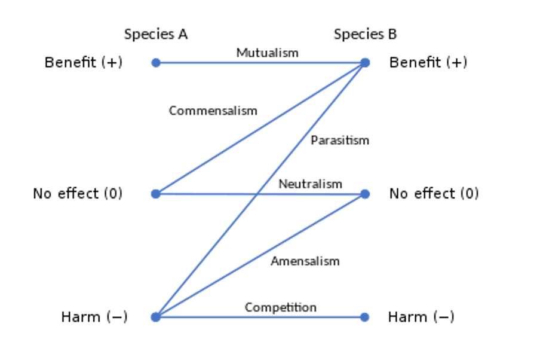

# From molecules to cells

## Module 1

## Module 2

## Module 3

## Module 4
### 4_1 Theories of Life, Microbes and Synthetic Biology
#### 1. Microorganisms: Definition & Types
- Definition: Small living things that requires microscope to be seen (Include single-cell)
- Prokaryotic microbes
    - Bacteria/Eubacteria, Archaebacteria 
- Eukaryotic microbes
    - Fungi, Protists, Microalgae
#### 2. Disproving Spontaneous Generation
- The Idea: Life could arise from non-living matter.
- Key Experiments:
    - Francesco Redi (1665): Showed maggots on meat came from flies, not the meat itself.
    - Lazzaro Spallanzani: Boiled broth and sealed it; no growth occurred. Contradicted Needham's earlier, less careful experiment.
    - Louis Pasteur (Swan-Neck Flask):
        - Boiled broth in a swan-neck flask; no growth occurred as dust was trapped in the neck.
        - Breaking the neck allowed dust (and microbes) in, causing growth.
        - **Conclusion**: Microbes are present in the air and cause spoilage. Life comes from pre-existing life (biogenesis).
#### 3. Origin of Life on Earth
- Fossil Evidence
    - **Stromatolites**: 3.5 billion years old (Australia)
    - Life likely began >3.8 billion years ago
- Hypotheses & Experiments
    - **Oparin-Haldane Hypothesis**
        - Life from inorganic molecules → building blocks
    - **Miller-Urey Experiment (1953)**
        - Simulated early Earth atmosphere $(H_2 O, NH_4, CH_4, N_2)$ + lightning
        - Produced amino acids, sugars, lipids
    - **RNA World Hypothesis**
        - Self-replicating RNA first (stores info + catalyzes = ribozymes)
        - Pre-RNA world: simpler RNA-like molecules first
    - **Genes-First Hypothesis**: 
        - First life was self-replicating nucleic acids (RNA or DNA); metabolism came later.
    - **Panspermia Hypothesis**
        - Organic molecules from space (meteorites)
        - Fringe theory for viable microbes
#### 4. Tree of Life and Microbes
- **Carl Woese's Model**: Established three domains: Bacteria, Archaea, Eukarya.
    - **Eukarya are more closely related to Archaea than to Bacteria**.
- **Lateral (Horizontal) Gene Transfer Theory** (Why Archaea and Bateria structurally similar but further phylogenetically?):
    - Widespread gene transfer between organisms, especially prokaryotes.
    - Challenges the traditional "Tree of Life" model, creating a web-like structure.
- **Endosymbiotic Theory**:
    - **Mitochondria** originated from endosymbiotic proteobacteria.
    - **Chloroplasts** originated from endosymbiotic cyanobacteria.
- **Genomic Reduction**:
    - an evolutionary process where parasite tend to discard excess, unused genomic information
#### 5. Description of the Key Microbial Groups:
##### Eukarya
- Larger genomes, but no correlation between organismal complexity and genome size, but genome size correlated cell volume
##### Archaea
- closely related to Eukarya (Phylogenetically)
- similar to bacteria, no membrane bound nucleus, have cell wall and flagella to move
- Cell wall: no peptidoglycan; Cell membrane: ether linked lipids
- Examples: 
    - Methanogens: produce methane
    - Halophiles: living in extremely salyt evironments
    - Thermophiles: Living in hot sulfurous water
##### Bacteria
- Cell wall: Peptidoglycan; Cell membrane: ester linked lipids
    - Example: 
        - methanotrophs: consume methane
        - Thermus aquaticus: source of Taq polymerase in PCR, which functions at 95C
#### 6. Genome Size vs. Complexity
##### Key Points
- No linear correlation between genome size and complexity (do have correlation)
- Eukaryotes have more non-coding DNA
##### Gene Number Examples
- Human: ~25,000 genes
- Yeast: ~6,000 genes
- Free-living bacteria: ~2,000-4,000 genes
#### 7. Virus
##### Characteristics
- Size: 25-300nm
- Structure: DNA/RNA + protein capsid ± lipid envelope
- Obligate intracellular parasites
##### The Debate
- **Life-like**: Replicate, evolve
- **Not life-like**: No metabolism, completely host-dependent
#### 8. Synthetic Biology
##### Definition
- Engineering genetic material for new characteristics
##### Approaches to Artificial Cells
**Top-Down**
- Simplify existing cell's genome
**Bottom-Up**
- Assemble from non-living components
##### J. Craig Venter's Synthetic Cell (2010)
1. **Assembly** complete Mycoplasma mycoides genome
2. **Transplantation** into M. capricolum cell
3. **Selection** with antibiotics
4. **Self-replication** achieved
### Future Directions
- Synthetic yeast genome (Sc2.0)
- Eukaryotic synthetic cells

### 4_2 Symbiosis and Human Microbiome
#### 1. Symbiosis: Definition & Classifications
##### Definition
- Living arrangements between two different species, called **symbionts**
- Includes both positive and negative associations
##### Three Main Types by Function
1. **Mutualism** (+/+): Both benefit
2. **Commensalism** (+/0): One benefits, other unaffected
3. **Parasitism** (+/-): One benefits, other harmed
##### Additional Classifications
- **Need**: Obligate (required, entirely depend) vs. Facultative (optional, do not have to)
- **Location**: Ectosymbiont (on surface) vs. Endosymbiont (inside)
- 
#### 2. Mutualism Examples
##### Corals and Symbiodinium
- **Coral provides**: Inorganic waste metabolites
- **Algae provides**: Organic nutrients **(glycerol, glucose)** via photosynthesis, serve as respiratory substrates, and support the growth can **calcium carbonate skeleton**
- **Breakdown (Thermal Stress)** = Coral bleaching $\rightarrow$ death
##### Clownfish and Sea Anemone
- **Clownfish**: slimy mucus protects from nematocysts(stinging cells releasinng toxins)
    - Benefits: Food scraps, protection, hiding place
- **Anemone benefits**: 
    - Benefites: Cleaned algae, prey luring, nitrogenous waste nutrients, scares anemone predators (Butterfly fish)
##### Nitrogen-Fixing Bacteria and Leguminous Plants
- **Bacteria (Rhizobium)**: Lives in root nodules, gets shelter, nutrients and water
- **Plants**: Get fixed nitrogen (ammonia, nitrite, nitrate)
- **Special adaptation**: 
    - Leghemoglobin controls oxygen levels for nitrogenase, which is produced only when they are in symbiosis 
    - Rhizobium needs some oxygen to generate energy for nitrogen fixation, yet its nitrogenase is inactivated by oxygen
    - Rhizobium can only fix nitrogen independetly under microaerophilic condition
    - A microaerophile is a microorganism that requires oxygen to survive, but requires environments containing lower levels of oxygen than that are present in the atmosphere
##### Mycorrhiza (Fungi and Plants)
- **Fungi benefites**: Sugars from roots
- **Plants get**: Extended surface area for nutrient absorption (especially phosphorus)
- **Example**: Truffles are ectomycorrhizae (Fungus and roots)
#### 3. Endosynbiotic Theory: Origin of eukaryotes
- Autogenous Model: Eukaryotic organelles evolved from internal membrane infoldings of ancestral prokaryotic cells, not symbiosis.
    - Evidence: some species of cyanobacteria (e.g., Gloeocapsa) have complex internal membrane systems and resemble simple chloroplasts.
- Endosymbiotic Theory: Organelles of eukaryotic cells are derived from symbiotic prokaryotes. Mitochondria in eukaryotes are descended from aerobic bacteria that were trapped by ancestral eukaryotic cells.
    - Evidence: Double membrane oganelles, own DNA for proteins and enzymes, reproduce/replicate like bacteria (binary fission); Phylogenetic analysis shows bacterial ancestry (α-Proteobacteria/alphaproteobacteria)
#### 4. Commensalism Examples
##### Barnacles and crab 
- Barnacles: Obtains food debris from the crab and are carried from one place to another
- Crab: Not benefited nor harmed
- Lost when the crab molts
##### Bacteria and bacteria
- When the waste is other's substrate
- **Nitrosomonas**: $NH_3^+ + 1.5 O_2^-> NO_2^- + H_2O + 2H^+$
- **Nitrobacter**: $NO_2^- + 0.5O_2 ->NO_3^-$
#### 5. Parasitism Examples
##### Tapeworm in humans
- **(Pork) Tapeworm benefits (in human or pig)**: Water, nutrients, shelter
- **Human harmed**: Nutrient loss
- **Pathogen**: Disease-producing microorganism
#### 6. Human Microbiome
##### Normal Microbiota
- Microbes living in long-term symbiotic relationship with host
- Found on all body surfaces (nose, mouth, skin, gut, vagina, etc.)
- **Normal** = long-term vs. **Transient** = temporary (days/weeks)
##### Factors Influencing Distribution
- Host genetics, age, environment
- Nutrients available
- Physical/chemical factors (temperature, pH, O₂, salinity)
- Mechanical factors (chewing, urine discharge)
##### Benefits of Normal Microbiota (Mutualism)
- **Probiotics**: Beneficial microbes (e.g., Lactobacillus)
- Digest food, promote mucus secretion, produce vitamins (K, B)
- **Microbial antagonism**: Normal flora inhibit pathogens
  - Vaginal pH 4 inhibits Candida
  - E. coli produces bacteriocins that inhibit Salmonella
##### When Microbiota Becomes Harmful
- **Opportunistic pathogens**: Normal flora cause disease in different environment
- **Examples**:
  - E. coli in urinary tract → infection
  - Clostridium difficile overgrowth after antibiotics → diarrhea
  - Candidiasis in immunocompromised patients
#### 7. Germ-Free Research
##### Gnotobiotic Animals
- Bred in sterile environments
- **Findings**: Can survive without microbes but have:
  - Undeveloped immune systems
  - Higher susceptibility to infection
  - Need more calories and vitamins
- Humans acquire microbiota within hours after birth
#### 8. Human Microbiome Project (HMP)
##### Overview
- Launched 2008 by NIH
- **Goal**: Study all microbes in/on human body
- **Method**: Metagenomic sequencing (DNA from mixed communities without culturing)
- **Samples**: 5,000+ from 242 healthy volunteers (nasal, oral, skin, GI, urogenital)
##### Major Findings (2012)
- >10,000 microbial species in human ecosystem
- Microbial cells outnumber human cells 10:1
- Bacterial genes 360× more abundant than human genes
- Personalized microbiome for each individual
- Same metabolic functions can be performed by different bacterial species
#### 9. Medical Applications & Future Directions
##### Fecal Microbiota Transplants
- Treatment for inflammatory bowel diseases (Crohn's, colitis)
- Restores healthy flora balance
- Currently used because bacterial communities are too complex to replicate artificially
##### Future Research Directions
- Develop new metagenome analysis technologies
- Associate specific microbes with health/disease states
- Study roles in nutrition, immunity, disease
- Longitudinal studies on microbiome changes
- Ethical, legal, social implications
