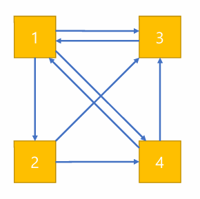

# General Mathematics
## I. Combinatorial Games and Zermelo’s Theorem
### Definition:
- **Strategy**: A strategy of a player is a **complete plan** for playing a game, taking all contingencies into account, including possible moves of the opponent.
    - **Winning Strategy**: A strategy that enables a player to win **no matter what moves the opponent makes**.
    - **Drawing strategy**: A strategy that guarantees that the player **does not lose**. 
- **Zermelo's Theorem**: 
    - **Finite Game**: A game that **terminates in finite number of moves**. 
    - **Perfect Information**: A game that **all players** can aware of **all aspects** of the structure of the game at **all times**. (No probability)
    - **Combinatorial Game**: Any **two-person game** of **perfect information** that moves **alternatively** is combinatorial game. (Can be not finite)
    - $\rightarrow$ Any **finite combinatorial game** that **cannot ends in a draw**, then one of the player must have a **dominant strategy**
- **Nash’s Strategy Stealing Argument**: In any symmetric game in which an extra move an never be a disadvantage, the first player has the dominant strategy. 
    - **Symmetric Game**: Either player has the same set of available moves

## II. Game theory
### Definition:
- **Solution of the Game**: The decision of the players
- **Dominant Strategy**: A strategy which is always better than any other strategy, regardless of what opponents may do.
- **Dominant Strategy Equilibrium**: The **solution (outcome)** when all the players choose their **dominant strategy**, so every player will ot change their decision anymore
- **Nash Equilibrium**: The solution of the game when no individual will change their position, **given the others do not change their positions**. 
    - Dominant strategy equilibrium $\subset$ Nash equilibrium
- **Mixed Strategy**: A mixed strategy of a player in a **repeated game** is **a probability distribution** over the player’s strategies.
    - **Pure Strategy**: A **mixed strategy** that the probability of choosing one strategy is 1
- **Mixed Nash Equilibrium**: The solution if no individual will change his mixed strategy, **given that the others do not change their mixed strategies**.
- **Nash Nobel-Prize-Winning Theorem**: Every finite n-player non cooperative game has a mixed Nash Equilibrium.
### How to find the Mixed Nash Equilirbium (Mixed Strategy)?
- Suppose $(p^*, q^*)$ is the mixed Nash Equilibrium, where $0 \le p^*, q^* \le 1$
```math
\begin{align*}
    & EU(L_i) = \sum_{k=1}^n p_{ik} u(x_k) \\
    & \implies E_A(p^*, q^*) \geq E_A(p, q^*), E_B(p^*, q^*) \ge E_A(p^*, q) \\
    & \implies E_K(p, q) = p q (k_{11} + k_{22} - k_{12} - k_{21}) + p (k_{21} - k_{22}) + q (k_{12} - k_{22}) + k_{22} \\
    & \implies \frac{\partial E_A}{\partial p} = q (a_{11} + a_{22} - a_{12} - a_{21}) + (a_{21} - a_{22}) \bigg|_{q = q^*} = 0 \\
    & \implies \frac{\partial E_B}{\partial q} = p (b_{11} + b_{22} - b_{12} - b_{21}) + (b_{12} - b_{22}) \bigg|_{p = p^*} = 0 \\
    & \implies (p^*, q^*) = \left( \frac{a_{22} - a_{21}}{a_{11} + a_{22} - a_{12} - a_{21}}, \frac{b_{22} - b_{21}}{b_{11} + b_{22} - b_{12} - b_{21}} \right) 
\end{align*}
```
- or without calculus, when $0 < p^*, q^* < 1$ 
```math
\begin{cases}
    E_A(1, q^*) = E_A(0, q*) \\
    E_B(p^*, 1) = E_B(p^*, 0) \\ 
\end{cases}
```
- ***REMEMBER TO CHECK ZEROS AND ONES!!!***

## III. Autions
### Definition:
- English Aution: The auctioneer begins with the lowest acceptable price (reserve price), increases til one bidder remains
- Dutch Aution: Begins at high level, and lowers until a bidder takes the price
- First price sealed-bid auction: Bid in a sealed envelope, and the highest bid wins, and pays one's bid
- Second price sealed-bid auction: Bid in a sealed envelope, and the highest bid wins, by paying the second highest cost
- What is the dominant strategy?
    - Bid their **True value**
    - Dutch and First price are "Strategically equivalent" as 
    ```math
    \begin{cases}
        v_i - b_i \quad \text{if i wins} \\
        0 \quad \text{if i loses} \\ 
    \end{cases}
    ```
    - English and Second price are "Strategically equivalent" when b is the 2nd highest bid as 
    ```math
    \begin{cases}
        v_i - b \quad \text{if i wins} \\
        0 \quad \text{if i loses} \\ 
    \end{cases}
    ```
    - If we assume bidders would bid higher in Second-price as we know we will pay less, we can say that Second-price is somehow similar to First-price

## IV. Shapley Value
### Prequisites:
- Let there are $n \ge 2$ players, so $N = {1, 2, ..., N}$ is the set of players
- S is a coalition if $S \subseteq N$, and the set of all coalitions is $2^N$ $$2^N = \{S|S \subseteq N\}$$
- $\varnothing$ is the **empty coalition**, while $N$ is the **grand coalition**
- For a game of coalitional form $(N;v)$, consist of 
    - (a set of) N players
    - a real-value function $\mathbb{v}$ defined on $2^N = \{ S|S \subseteq N\}$ such that $\boxed{v(\varnothing) = 0}$
    - Function $\mathbb{v}$ is called **coalition function/characteristic function**, $v(S)$ is the **value/worth** of coalition S
### Axioms for players in (N;v):
- I. Symmetric Players/Substitutes
```math
\text{if } i, j \notin S, \text{ for all } S, v(S \cup \{ i \}) = v(S \cup \{ j \})
```
- II. Null Players
```math
v(S \cup \{ i \}) = v(S) \text{ for all } S \subset N \implies v(i) = 0
```
- III. Sum of Games
```math
(N;v) \text{ is the sum of two games } (N;u) \text{ and } (N;w),  \\ \text{ if for every } S \subset N, v(S) = u(S) + w(S)
```
### Shapley Value Theorems:
- I. There exists a unique Shapley $\phi = (\phi_1, ...,\phi_n)$
- II. The Shapley value is 
    ```math
    \phi_i = \frac{1}{n!}\sum_{\sigma\in S_n}\Bigl(v\bigl(N_{i}^{\sigma}\cup\{i\}\bigr)-v\bigl(N_{i}^{\sigma}\bigr)\Bigr) 
    ```
    - where $N_{i}^{\sigma}$ represents the set of players preceding $i$ in $N$ corresponding to the permutation $\sigma$ on $N$
### Two ways to find Shapley values:
#### Spliting method
- split into **carrier games**
    - A carrier game (N;v) is a game in which there is a coalition T, which is the carrier, such that
    ```math
    \begin{cases} v(S) = v(T), \text{ whenever }T \subset S \\ v(S) = 0 \text{ otherwise} \\ \end{cases}
    ```
- Table by the formula
    ```math
    \begin{array}{lccc}
        & \mathbf{1} & \mathbf{2} & \mathbf{3} \\[4pt]
        123 & a_{123,1} & a_{123,2} & a_{123,3} \\
        132 & a_{132,1} & a_{132,2} & a_{132,3} \\
        213 & a_{213,1} & a_{213,2} & a_{213,3} \\
        231 & a_{231,1} & a_{231,2} & a_{231,3} \\
        312 & a_{312,1} & a_{312,2} & a_{312,3} \\
        321 & a_{321,1} & a_{321,2} & a_{321,3} \\[4pt]
        \mathbf{\phi_i} & \text{sum/n!} & \text{sum/n!} & \text{sum/n!} \\
    \end{array}
    ```
## V. How to find love? (This is literally the lecture topic name)
### How to maximise the chance of getting the best partner?
- For N people, reject the first x% of them, and then choose the one who are better than all of the x% people
$$\begin{align*}
    P(s) = \frac{1}{N} \times \left( 1+ \sum_{k = s+1}^{N-1} \frac{s}{k} \right) \approx \frac{s}{N} \int_{s}^{N} \frac{dx}{x} &\implies P(s/N = x) = -x \ln{x} \\
    \frac{dP(x)}{dx} = -\ln{x} - 1 \bigg|_{x = x_0} = 0 &\implies x = \frac{1}{e}
\end{align*}$$
```python
import matplotlib.pyplot as plt
import numpy as np
import random as random

def main(N):
    result = []
    x = list(range(1, N+1))
    for i in range(1, N+1):
        s = 0
        for t in range(1000):
            y = list(range(1, N+1))
            random.shuffle(y)
            for j in range(i, N):
                if y[j] > max(y[:i]):
                    if y[j] == N:
                        s += 1
                    break
        result.append(s/1000)
    plt.bar(x,result)

    x_curve = np.linspace(1, N, 1000)
    normalized_x = x_curve / N  
    y_curve = -normalized_x * np.log(normalized_x)  
    plt.plot(x_curve, y_curve, 'r-', label='y = -x ln(x/N)')
    
    plt.legend()
    plt.show()


main(100)
```
### Ramsey's Theorem
- For every coloring of the k-subsets of a sufficiently large set X, there is an s-element subsets of X whose k-subsets all have the same color. 
### How to propose
- Presupposition: If S is true, kiss; if S is false, not to kiss $K \leftrightarrow S$
- S: neither kiss nor marry $S = \neg K \wedge \neg M$
$$
\begin{array}{lll}
1. & K \leftrightarrow (\neg K \land \neg M) & \text{Premise} \\
2. & K \to (\neg K \land \neg M) & \text{from 1, Equiv} \\
3. & (\neg K \land \neg M) \to K & \text{from 1, Equiv} \\
\hline
4. & \text{Assume } K & \text{Assumption (subproof)} \\
5. & \neg K \land \neg M & 2,\,4,\ \text{MP (apply consequent }(\neg K\land\neg M)\text{)} \\
6. & \neg K & 5,\ \text{Simp (extract consequent's conjunct } \neg K\text{)} \\
7. & \bot & 4,\,6,\ \text{Contradiction (}K\land\neg K\text{)} \\
8. & \neg K & 4\text{--}7,\ \text{RAA (from contradiction)} \\
\hline
9. & \text{Assume } \neg M & \text{Assumption (subproof)} \\
10.& \neg K \land \neg M & 8,\,9,\ \text{Conj (combine } \neg K \text{ and } \neg M\text{)} \\
11.& K & 10,\,3,\ \text{MP (apply consequent }K\text{ of }(\neg K\land\neg M)\to K\text{)} \\
12.& \bot & 8,\,11,\ \text{Contradiction (}\neg K\land K\text{)} \\
13.& \neg\neg M & 9\text{--}12,\ \text{RAA (} \neg M \text{ leads to contradiction)} \\
14.& M & 13,\ \text{DN}
\end{array}
$$
### How to divorce
- Adjusted Winner procedure
    - Properties
        - 1. Get the same points
        - 2. No one is going to exchange to whole sharing
        - 3. No other allocation increases the toatl number of pts (Hard to prove))
    - Procedures
        - 1. Each party allocates 100 points across items.
        - 2. Give each item to the higher bidder.
        - 3. Compare total scores; if equal, stop.
        - 4. From the higher-scoring party, rank their items by (their points)/(other’s points) ascending.
        - 5. Move items in that order to the other party until totals would cross; split the last item fractionally to equalize.
        - 6. Return allocation (at most one split).

## VI. Error Control Codes
### Prequisite
- Error-Correction Code: Reconstructing missing information
- Error Control is divided into **Error Detection** and **Error Correction**
- Code rate = Leangth of original message/Length of encoded message
- Correction power: 1-error = single-error; 2-error = double-error
$$\text{Data} \rightarrow \boxed{\text{Encoder}} \rightarrow \text{Codeword/Encoded Data} + \text{Noise} \rightarrow \text{Corrupted Data} \rightarrow \text{Decoder}$$
### ECC - Error Detection/Correction (Control) Codes
#### 1.Repitition Codes (Simple, High Cose)
- Repetition by 2: Can **detect** any 1-error, Can **detect** some 2-errors, ***Cannot Correct***, code rate = 1/2
- Repetition by 3: Can **correct** 1-error, code rate = 1/3
#### 2. Check digit/bits (moderate, low cost)
- i. ID number
    - for $\Omega n_1 n_2 n_3 n_4 n_5 n_6 (n_7)$, $\Omega$ is transfer to 1-11 under mod 11, while $n_7$ is the check digit
    - $\sum_{i = 0}^{7}(8-i) \cdot n_i$, if $n_7 = 10$, replace by "A"
    - Propositions:
        - (a) can detect all 1-errors (n1~n7)
        - (b) cannot detect 2-errors
        - (c) Cannot correct 1-errors
- ii. ISBN
    - For 10-digit ISBN10, $\sum_{1}^10 (11-i) \cdot$
- iii. Credit Card Number

#### 3. Hamming codes (sophisticated, low cost)
#### 4. QR code (popular)

## VII. Cryptography
## VIII. Probability
## IX. Internet Search - PageRank
### Core idea
- A link from page A to page B is a vote for B's importance. Not all votes are equal; a vote from an important page counts more.
- Definition: 
    - **Importatn Score**:  A non-negative number representing the rating of the web page’s importance level (the overall value of a page in the web).
    - **Backlinks**:  The inbound links to a given page are called the backlinks of that page
### PageRank
- $n$ pages, use arrow represent each forward link, $x_i$ as the **importance score**
- Three rules to determine the Importance Score
    - Rule 0. Omit the hyperlinks, all pages are equally important, assigning equal score $(x_i = 1)$
    - Rule 1. Higher Score if pointed by more pages
    - Rule 2. Higher Score if pointed by important pages
- Lets say $i \rightarrow j$, then Page j should absorb the **Influence Power** of i
    - 
    - $$\text{1-st iteration:} \begin{cases}
        x'_1 = 0\cdot x_1 + 0\cdot x_2 + 1\cdot x_3 + \dfrac{1}{2}\cdot x_4, \\
        x'_2 = \dfrac{1}{3}\cdot x_1 + 0\cdot x_2 + 0\cdot x_3 + 0\cdot x_4, \\
        x'_3 = \dfrac{1}{3}\cdot x_1 + \dfrac{1}{2}\cdot x_2 + 0\cdot x_3 + \dfrac{1}{2}\cdot x_4, \\
        x'_4 = \dfrac{1}{3}\cdot x_1 + \dfrac{1}{2}\cdot x_2 + 0\cdot x_3 + 0\cdot x_4. \end{cases} \implies \begin{bmatrix}
        x'_1 \\ x'_2 \\ x'_3 \\ x'_4
        \end{bmatrix}
        =
        \begin{bmatrix}
        0 & 0 & 1 & 0.5 \\
        0.33 & 0 & 0 & 0 \\
        0.33 & 0.5 & 0 & 0.5 \\
        0.33 & 0.5 & 0 & 0
        \end{bmatrix}
        \begin{bmatrix}
        x_1 \\ x_2 \\ x_3 \\ x_4
        \end{bmatrix}$$
    - $$\text{k-th iteration: } \mathbf{x}^{[k]} =
        \begin{bmatrix}
        x_1^{[k]} \\ x_2^{[k]} \\ x_3^{[k]} \\ x_4^{[k]}
        \end{bmatrix}
        =
        \begin{bmatrix}
        0 & 0 & 1 & 0.5 \\
        0.33 & 0 & 0 & 0 \\
        0.33 & 0.5 & 0 & 0.5 \\
        0.33 & 0.5 & 0 & 0
        \end{bmatrix}
        \begin{bmatrix}
        x_1^{[k-1]} \\ x_2^{[k-1]} \\ x_3^{[k-1]} \\ x_4^{[k-1]}
        \end{bmatrix} = A\mathbf{x}^{[k-1]} = A^{[k]}\mathbf{x^[0]} 
    - as $k \rightarrow \infty, \mathbf{x}^{[k]} \rightarrow \mathbf{v}$, where $\mathbf{v}$ is the **"steady state"** 
    - $$\text{If } \mathbf{x}^{(0)} =
        \begin{bmatrix}
        1 \\ 1 \\ 1 \\ 1
        \end{bmatrix}, \quad
        \mathbf{v} = A^k \mathbf{x}^{(0)} =
        \begin{bmatrix}
        0 & 0 & 1 & 0.5 \\
        0.33 & 0 & 0 & 0 \\
        0.33 & 0.5 & 0 & 0.5 \\
        0.33 & 0.5 & 0 & 0
        \end{bmatrix}^k
        \begin{bmatrix}
        1 \\ 1 \\ 1 \\ 1
        \end{bmatrix}
        \rightarrow
        \begin{bmatrix}
        1.548 \\ 0.516 \\ 1.161 \\ 0.774
        \end{bmatrix} = \mathbf{v} $$
    - $$\text{But we would not set }\mathbf{x}^{(0)} =
        \begin{bmatrix}
        1 \\ 1 \\ 1 \\ 1
        \end{bmatrix} , \text{but }\mathbf{x}_{n \times 1}^{(0)} =
        \begin{bmatrix}
        1/n \\ 1/n \\ \vdots \\ 1/n
        \end{bmatrix} \text{for normalization}$$

- Properties and problems of $A\mathbf{v} = \mathbf{v}$
    - I. Existence and Normalization: $A(k \mathbf{v}) = k\mathbf{v}$
        - just as mentioned, $\mathbf{x}_{n \times 1}^{(0)} = \begin{bmatrix} 1/n,  1/n ,  \cdots ,  1/n \end{bmatrix}^T, \text{and all column sum to 1}$
        - Note that $a_{ii} = 0, \text{at least ONE nonzero entry}, a_{ij} = \frac{|j \rightarrow i|}{|j \rightarrow ?|} \rightarrow \text{all column sum to 1}$
        - Does it converges(Existence)?
            - ***Limiting Scores theorem***
            - **if the web is interconnected (VERY IMPORTANT)**
                -  if it does not converges at k, then at k-1 it converges
                - so $$\mathbf{v}^{[k]} := \frac{1}{k}(\sum_{i = 0}^{k-1} \mathbf{x}^{[i]})$$
    - II. Nonnegativity: Are all entries of $\mathbf{v}$ nonnegative?
    - III. Uniqueness: Is there $\mathbf{w} such that A\mathbf{v} = \mathbf{v} but \mathbf{v} \neq k\mathbf{v}$
        - Yes, if there are dangling nodes (with 2 or more subwebs, we dont know which one is more important)
    - *Link matrix is column-stochastic, but not positive*
        - ***Column-Stochastic***: all entries nonnegative, each column sum to 1
        - ***Positive***: All entries positive
- Resolution: Considering someone would do "Random Surfing" and "Following hyperlinks"
    - $M = (1-m)A + mS, 0 < m < 1$
        - S represents "Random surfing", a n by n matrix with all entries equal to 1/n
        - A, as mentioned, represents "Following hyperlinks"
    - Properties of M (**Perron-Frobenius** Theorem), which Solves II and III
        - I. If M is positive and column-stochastic, then any nonzero $M\mathbf{v} = \mathbf{v}$, all entries of $\mathbf{v}$ are either **positive** or **negative**
        - II. If M is positive and column-stochastic, then for any $M\mathbf{v} = \mathbf{v}$,  $\mathbf{v} \in \{\mathbf{v}|k \mathbf{v} \}$
    - Is Issue I solved?
        - We know that $||x|| = 1, \text{then } ||Ax|| = 1$
        - $||Mx|| = ||(1-m)Ax||+||mSx|| = (1-m)+m = 1$
        - so Yes
### Remarks
- M is something cant see, A is something can see (in the formula)